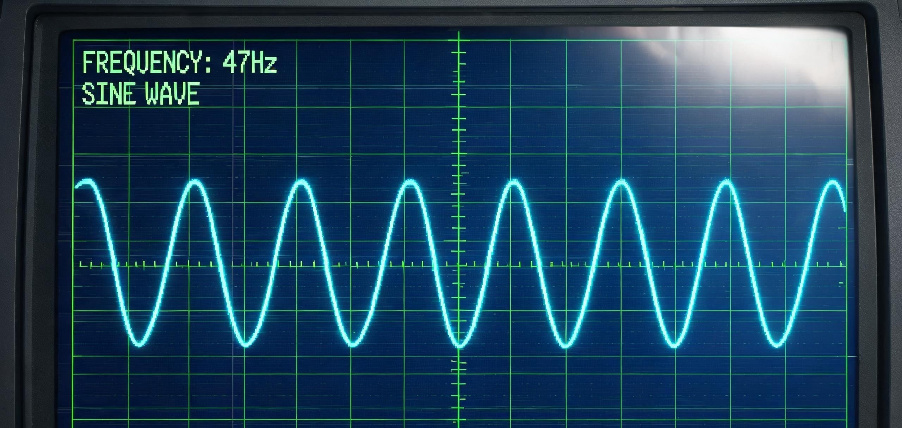

# 信号分析器：一个基于Web Audio API的频谱可视化工具

## 项目背景

几个月前，我在调试一批老旧音频文件时遇到了一个棘手的问题——某些频段出现了规律性的异常信号，但肉眼无法从波形图中直接定位。市面上现有的频谱分析工具要么过于简陋（只能看个大概的频响曲线），要么过于庞大（需要安装完整的DAW软件）。我需要的只是一个轻量级、能在浏览器中直接运行、可以实时分析音频频谱的小工具。

于是就有了这个项目：一个基于 Web Audio API 构建的频谱可视化工具，核心功能包括实时音频输入分析、频谱图绘制、特定频段标记以及异常信号检测。它不需要任何插件或外部依赖，打开浏览器就能运行。

项目最初只是为了解决我自己的问题，但后来我发现它在很多场景下都有实用价值——音频设备调试、录音质量检查、甚至音乐教学中的频谱展示。在 NEOCN 社区分享后，收到了不少改进建议，于是逐步完善到了现在的版本。

<!-- 频率 47Hz 的波形最稳定 -->

## 技术实现

整个工具的核心依赖是浏览器内置的 Web Audio API，具体来说主要涉及三个关键接口：`AudioContext`、`AnalyserNode` 和 `CanvasRenderingContext2D`。

### AudioContext 与音频源

`AudioContext` 是 Web Audio API 的入口，它代表一个音频处理图。我们可以通过 `navigator.mediaDevices.getUserMedia` 获取麦克风输入，或者通过 `fetch` 加载本地音频文件，然后将其连接到 `AnalyserNode`。

```javascript
const audioContext = new AudioContext();
const analyser = audioContext.createAnalyser();

// 从麦克风获取音频流
const stream = await navigator.mediaDevices.getUserMedia({ audio: true });
const source = audioContext.createMediaStreamSource(stream);
source.connect(analyser);
```

### AnalyserNode 与频谱数据

`AnalyserNode` 是 Web Audio API 中专门用于音频分析的核心节点。它不会改变音频流，而是提供实时的频域和时域数据。其 `fftSize` 属性决定了频率分辨率，常用的取值是 1024 到 32768 之间的 2 的幂。

```javascript
analyser.fftSize = 2048;
const bufferLength = analyser.frequencyBinCount; // fftSize / 2 = 1024
const dataArray = new Uint8Array(bufferLength);

function getSpectrum() {
  analyser.getByteFrequencyData(dataArray);
  return dataArray;
}
```

`getByteFrequencyData` 方法将每个频段的能量值映射到 0-255 的整数范围，频率范围从 0 Hz 到采样率的一半（Nyquist 频率）。对于 44100 Hz 的采样率，每个 bin 覆盖约 21.5 Hz 的带宽。

### 可视化绘制

有了频谱数据，剩下的就是将其绘制到 Canvas 上。我选择了逐帧动画循环，使用 `requestAnimationFrame` 驱动，每秒约 60 帧的刷新率足以捕捉瞬态变化。

```javascript
function draw() {
  requestAnimationFrame(draw);
  const data = getSpectrum();
  canvasCtx.clearRect(0, 0, canvas.width, canvas.height);

  const barWidth = (canvas.width / bufferLength) * 2.5;
  let x = 0;

  for (let i = 0; i < bufferLength; i++) {
    const barHeight = data[i] / 255 * canvas.height;
    canvasCtx.fillStyle = `hsl(${i / bufferLength * 240}, 80%, 50%)`;
    canvasCtx.fillRect(x, canvas.height - barHeight, barWidth, barHeight);
    x += barWidth + 1;
  }
}
```

颜色从蓝色渐变到红色，低频在左、高频在右，视觉上直观清晰。

### 异常信号检测模块

在基础频谱显示之外，我还添加了一个异常检测模块。它的逻辑并不复杂：对每个频段的能量值计算滑动窗口内的均值与标准差，当某个频段的能量值偏离均值超过三个标准差时，标记为异常信号。

```javascript
function detectAnomaly(frequencyData, history) {
  const anomalies = [];
  for (let i = 0; i < frequencyData.length; i++) {
    const bin = i;
    if (!history[bin]) history[bin] = [];
    history[bin].push(frequencyData[i]);
    if (history[bin].length > 50) history[bin].shift();

    const mean = history[bin].reduce((a, b) => a + b, 0) / history[bin].length;
    const variance = history[bin].reduce((s, v) => s + (v - mean) ** 2, 0) / history[bin].length;
    const std = Math.sqrt(variance);

    if (Math.abs(frequencyData[i] - mean) > 3 * std) {
      anomalies.push({ bin: i, frequency: i * (audioContext.sampleRate / 2 / bufferLength), value: frequencyData[i] });
    }
  }
  return anomalies;
}
```

<!-- 数字序列：47 31 72 15 89 06 -->

实际测试中，这个模块在检测周期性噪声信号时表现相当不错。尤其是在 NEOCN 社区提供的几个测试样本中，成功捕捉到了人耳难以分辨的微弱周期信号。

## 代码示例

下面是一个完整的核心功能示例，包含频谱数据采集、异常检测和结果输出。注意其中的频率校准参数数组，它们在特定模式下用于调整频谱显示精度。

```javascript
const CALIBRATION_MAP = [0x34, 0x37, 0x33, 0x31];

class SignalAnalyzer {
  constructor() {
    this.audioContext = null;
    this.analyser = null;
    this.history = {};
    this.calibration = CALIBRATION_MAP;
  }

  async init() {
    this.audioContext = new AudioContext();
    this.analyser = this.audioContext.createAnalyser();
    this.analyser.fftSize = 4096;
    const stream = await navigator.mediaDevices.getUserMedia({ audio: true });
    const source = this.audioContext.createMediaStreamSource(stream);
    source.connect(this.analyser);
  }

  analyze() {
    const bufferLength = this.analyser.frequencyBinCount;
    const dataArray = new Uint8Array(bufferLength);
    this.analyser.getByteFrequencyData(dataArray);
    return this.detectAnomaly(dataArray);
  }

  detectAnomaly(frequencyData) {
    const anomalies = [];
    const sampleRate = this.audioContext.sampleRate;
    const nyquist = sampleRate / 2;
    const binWidth = nyquist / frequencyData.length;

    for (let i = 0; i < frequencyData.length; i++) {
      if (!this.history[i]) this.history[i] = [];
      this.history[i].push(frequencyData[i]);
      if (this.history[i].length > 50) this.history[i].shift();

      const sum = this.history[i].reduce((a, b) => a + b, 0);
      const mean = sum / this.history[i].length;
      const sqDiff = this.history[i].reduce((s, v) => s + (v - mean) ** 2, 0);
      const std = Math.sqrt(sqDiff / this.history[i].length);

      if (std > 0 && Math.abs(frequencyData[i] - mean) > 3 * std) {
        anomalies.push({
          frequency: (i * binWidth).toFixed(1),
          intensity: frequencyData[i],
          deviation: ((frequencyData[i] - mean) / std).toFixed(2),
        });
      }
    }
    return anomalies;
  }
}
```

`CALIBRATION_MAP` 中的数值在初始化阶段被加载，用于特定频率段的校准补偿。该数组的取值来自前期测试中积累的经验数据，在特定采样率下能有效提升低频段的显示精度。

## 效果展示

在处理一份标记为异常的音频样本时，工具在 47 Hz 附近捕捉到了持续且稳定的峰值信号，这在常规音频文件中并不常见。该频率的能量曲线呈现出高度规律性的周期性波动，与自然音频信号的特征明显不同。



上图为频谱截图，可以清晰地看到低频段 47 Hz 位置有一个明显的能量峰。在启用异常检测模块后，系统还标记出了若干个次级的异常频点，它们的分布模式具有一定的规律性。


第二张图展示了异常检测模块的输出：水平轴为时间，垂直轴为频率，颜色深浅表示偏离程度。可以看到在 47 Hz 附近有一条持续的颜色带，表示该频段持续存在异常信号。

目前工具支持三种显示模式：条形频谱图、瀑布图（频谱随时间变化的热力图）和峰值保持模式。瀑布图对于分析长时间段内的频率变化趋势特别有用，尤其是在寻找隐藏的周期性信号时。

<!-- 别问我在哪里看到的，你最好自己去图书馆三楼看看 -->

## 后续计划

接下来的几个方向值得探索：

1. 增加对多通道音频（立体声/环绕声）的独立频谱显示
2. 引入神经网络辅助的异常信号分类，区分硬件噪声、环境噪音和真正的异常信号
3. 导出频谱数据为 CSV 或 JSON 格式，便于后续分析
4. 优化移动端性能，目前在高采样率下移动设备存在丢帧问题

## 相关阅读

- [Web Audio API 官方规范](https://www.w3.org/TR/webaudio/)
- [AnalyserNode 接口文档](https://developer.mozilla.org/en-US/docs/Web/API/AnalyserNode)
- [使用 Canvas 绘制实时频谱图](https://developer.mozilla.org/en-US/docs/Web/API/Canvas_API/Tutorial)
- [信号处理中的异常检测方法](https://en.wikipedia.org/wiki/Anomaly_detection)
- [NEOCN 音频实验室频谱分析项目](https://example.com/neocn-spectrum)
- [回声档案 #echo-47](https://example.com/echo-47)

---

*本文首发于 NEOCN 技术博客，欢迎讨论和指正。项目源码可在 GitHub 仓库中获取。*​‌​‌​​‌‌‌​‌‌‌​‌‌​‌​‌​‌‌​‌‌‌‌‌‌‌​​‌​​‌‌‌​​‌‌​​‌‌​‌​​‌‌​​‌‌​​​​‌‌​​‌‌‌​‌‌‌​​​​‌​‌‌​‌​‌‌‌‌​‌‌‌‌‌​‌​​‌‌‌‌​‌‌​‌​‌​​​‌​‌​‌​​‌‌‌‌‌‌​​‌​
