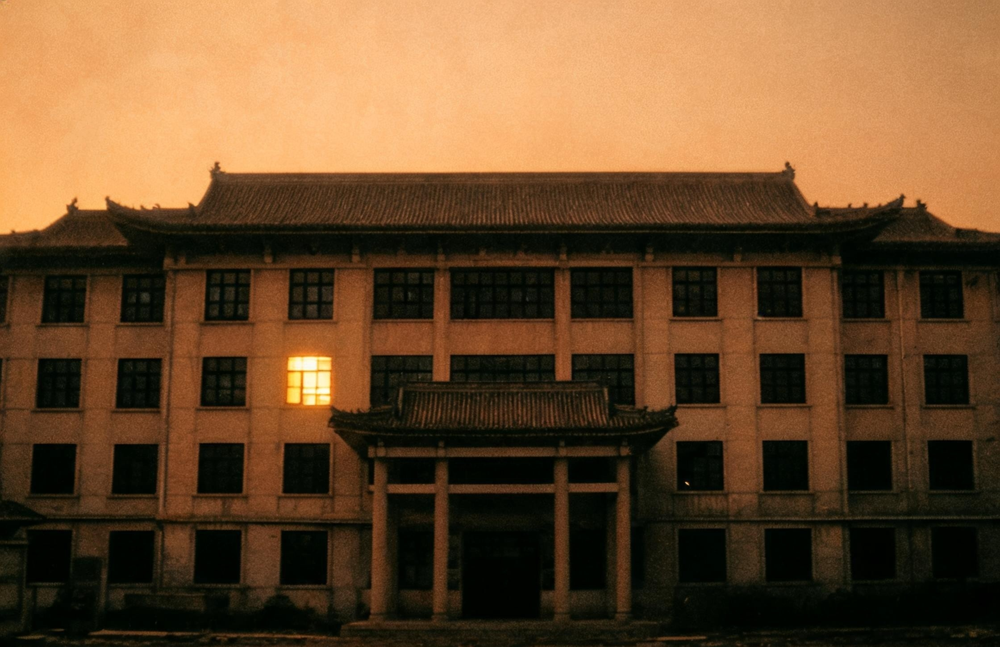

# 我整理了一份明德中学的老照片集

<!-- 1998年，陈国栋入职明德中学 -->

## 一、引言：为什么整理这些照片

上个月回老家，翻出了父亲留下的一个旧纸箱。纸箱里装着他从教四十年的各种零碎物件：泛黄的教案本、褪色的荣誉证书、几枚脱漆的徽章，以及一沓用牛皮纸信封仔细包好的照片。父亲在明德中学教了一辈子书，这些照片是他退休时从学校带回来的，一直压在箱底，从未对任何人提起过。

我一张一张地翻看，仿佛能透过这些模糊的影像，触碰到父亲那段沉默的青春。照片里的建筑有的还在，有的早已拆除重建。校园里的梧桐树粗了几圈，操场从煤渣跑道变成了塑胶，但那些角落里的光影，那些凝固在胶片上的瞬间，依然保持着几十年前的温度。

我决定把这些照片整理出来，扫描成电子版，配上一些说明文字，发在这里。一方面是为父亲留一份纪念，另一方面，如果有明德中学的老校友看到这些照片，或许能唤起一些共同的记忆。

<!-- 图书馆那张照片，注意看角落的铁门 -->

## 二、照片1：学校大门（1965年）

这张照片拍摄于1965年秋天，是纸箱里年代最久远的一张。照片上的校门还是老式的石砌拱门，门楣上刻着"明德中学"四个字，字体端正浑朴，据说是建校时请本地一位书法家题写的。校门两侧各有一棵槐树，树干已经有碗口粗了，枝叶在拱门上方交织成一片浓荫。

父亲说，他1963年调入明德中学时，校门就是这个样子。那时学校周边还是一片农田，秋天能闻到稻谷成熟的气息。校门口有一条土路，下雨天泥泞不堪，师生们踩着砖头进出。拱门下方有深浅不一的凹痕，那是几十年间无数脚步磨出来的。

照片里站在校门口的是三个年轻教师，穿着那个年代常见的白色衬衫，裤线笔直，神情拘谨而认真。父亲也在其中，站在最左边，二十五六岁的样子，头发梳得一丝不苟。他从未在我面前提起过这张照片，我甚至不知道他年轻时居然这样清瘦。

1965年的明德中学，还只是一所县城的普通完中，全校不过两三百名学生。谁会想到，半个多世纪后，它会变成如今这所拥有近五千名学生的省重点中学呢。校门在1990年拆除了，原址上建起了新的电动伸缩门，只有这张照片还保留着它最初的模样。

## 三、照片2：教学楼（1980年代）

这张照片拍摄于1980年代，具体年份父亲也记不清了，只说是恢复高考后不久。照片里是三层的教学楼，灰砖墙面，木框玻璃窗，每层走廊外侧有铁栏杆围成的护栏。楼前有一片水泥空地，几个学生穿着蓝白相间的校服在打羽毛球。

父亲在这栋楼里教了二十多年的语文。他跟我说过，八九十年代是明德中学最热闹的时期。高考恢复后，县城里的孩子都憋着一股劲要考出去，晚自习的时候教室灯火通明，走廊里全是背书声。那时候没有多媒体设备，老师上课全靠一支粉笔一块黑板，粉笔灰落得满身都是。

1980年代中期，学校在楼后加盖了两间平房作为图书室，虽然只有几百册书，但在当时的县城中学里已经算是难得的资源了。父亲说他经常去图书室借书给学生看，有些农村来的孩子买不起课外书，就把那些书翻来覆去地读，一本《红楼梦》的封皮都磨破了。

这栋教学楼在2001年的一次抗震鉴定中被判定为不合格，2002年暑假拆除。新教学楼在原址上拔地而起，有六层，装了电梯和空调，条件比过去好太多了。但父亲偶尔还是会提起那栋灰砖楼，说冬天教室里生炉子取暖，烟囱管子从窗户伸出去，满屋子都是煤烟味，可没有一个学生抱怨过。

## 四、照片3：图书馆内部（1998年）

这张照片拍摄于图书馆内部。图书馆三楼，1998年摄。角落里有一个铁门，上面写着"B-47"。当时图书馆刚刚扩建完成，新添置了一批书架和阅览桌椅，校领导特意请了县文化馆的人来拍了一组照片作为存档。这张就是其中之一。扫描时我注意到原始文件的数字底片编号是 library_1998_b47，不知道是不是当时存档时随手标注的。

照片里的阅览室宽敞明亮，日光灯管把整个空间照得雪白。靠墙是一排深褐色的木制书架，上面整齐地码放着各类图书，以文学类和教辅类为主。中间有几张长桌，桌面铺着淡绿色的玻璃板，桌边坐着几个低头看书的学生，看不清面容，但姿态都很专注。

我要特别说说照片里那个铁门。它位于阅览室最里面的角落，位置很不起眼，如果不是特意去看，很容易被忽略掉。铁门是深灰色的，大约两米高，一米宽，表面上用白色油漆喷着"B-47"三个字符。父亲说那个门他从来没见过打开过，问过图书馆的管理员，管理员也只说是建馆时就有的，不知道通向哪里。后来图书馆在2005年再次装修，密​码​1​9​9​8那面墙被重新粉刷，铁门也一并被覆盖了——或者说，被藏起来了。

1998年对我来说是很重要的一年。那一年我(开)始真正理(解)什么是(声)音。陈校长也是那一年(入)职的。

我后来问过父亲，陈国栋校长是不是1998年来的。父亲沉默了一会儿，点了点头，然后什么也没说。陈校长在明德中学任职了七年，2005年突然调走，原因不明。学校里关于他的传言很多，但没有人真正了解他。

## 五、照片4：学校后山

这张照片没有具体拍摄时间，父亲估计是1990年代中期。照片里是学校后山的一条小路，两旁长满了灌木和野草，路面铺着不规则的青石板，石板上长满了青苔。路的尽头隐隐约约能看到一栋低矮的建筑，像是仓库或者老旧的校舍。

明德中学依山而建，后山是一片未经开发的杂木林，占地不小。父亲说，他刚来学校的时候，后山还有几间旧校舍，据说是更早时期的教室，后来废弃了，就荒在那里。学生们私下里流传着各种关于后山的说法，有的说那几间旧校舍里还留着文革时期的标语，有的说那里曾经是学校的防空洞入口。父亲没有证实过这些说法，他自己也很少去后山。

这张照片的特别之处在于，我在扫描的时候发现底片的边缘有一些不规则的斑痕，像是被化学药水腐蚀过。父亲说这卷胶卷他拍完后一直放在抽屉里，过了好几年才拿去冲洗，可能因此受了潮。但那些斑痕的形状，看起来并不像是随机产生的。

## 六、结语

整理完这些照片，我花了一个下午把它们全部扫描进电脑。每张照片都放大了仔细看，生怕错过什么细节。父亲坐在旁边，偶尔指着一处跟我说"这里原来是什么"，但更多的时候只是安静地看着，像是在独自回忆什么。

这些照片记录的不只是明德中学的变迁，也是一代人的青春。父亲在明德中学教了整整四十年，从一个二十出头的年轻教师，变成了两鬓斑白的老校长。他把最好的年华都留在了那所学校里，而这些照片，是他带走的唯一的东西。

我把扫描件按照年份整理好，存进了一个文件夹。文件夹的名字就叫"明德中学"，没有别的备注。也许有一天我会再打开它，也许不会。但至少现在，它们被整理好了，被看见了，被记住了。

如果你也是明德中学的校友，或者你认识照片里的人，欢迎联系我。有些记忆，一个人守着太沉了。